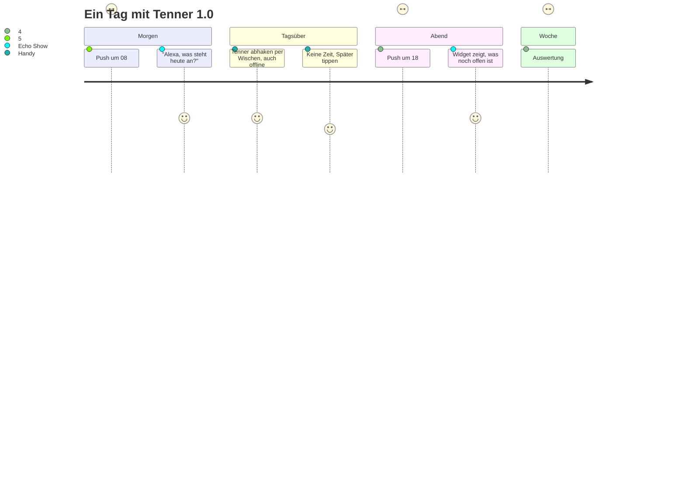
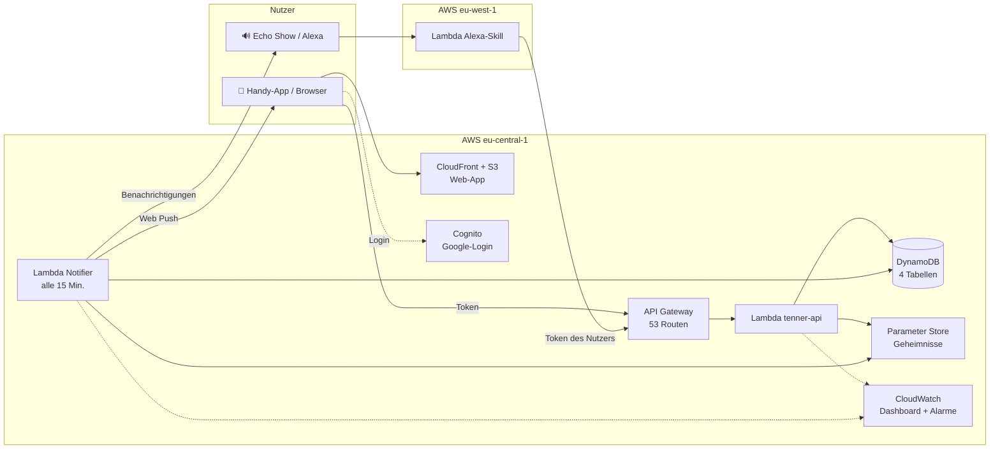
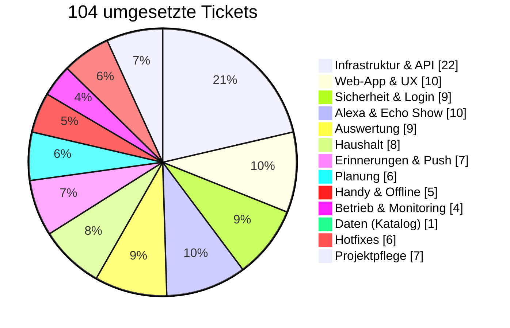
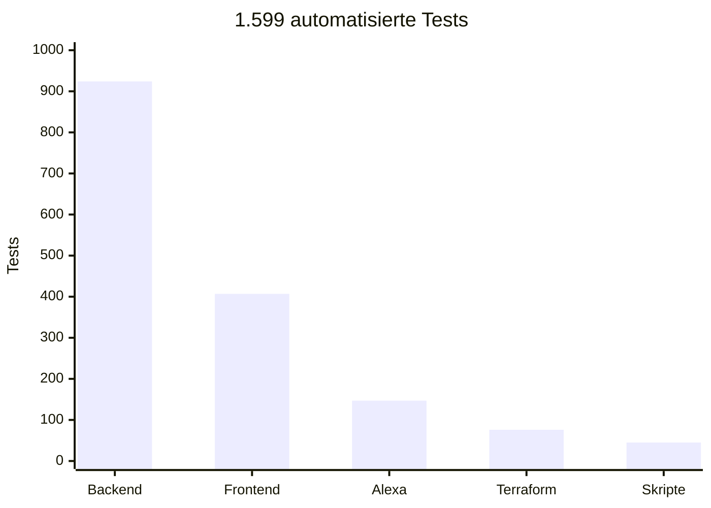
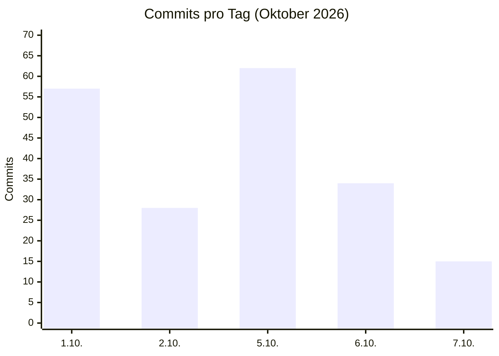
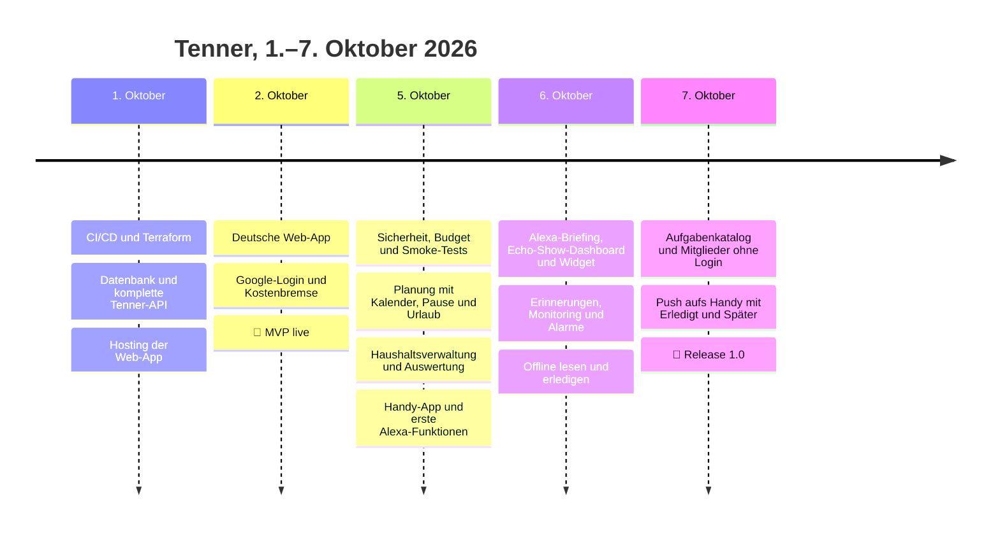

# 🟢 Tenner 1.0 — Release Notes

> ## **Zehn Minuten. Ein Haushalt, der läuft.**
>
> *Tenner zerlegt alles, was im Haushalt immer wieder ansteht, in kleine Zehn-Minuten-Aufgaben und erinnert die
> richtige Person zur richtigen Zeit: am Handy, im Browser und auf dem Echo Show.*

| | |
|---|---|
| **Version** | 1.0.0 (Git-Tag `v1.0.0`) |
| **Codename** | Grundstein |
| **Veröffentlicht** | 7. Oktober 2026 |
| **Status** | Stable, General Availability für einen Haushalt |
| **Betrieb ab jetzt** | Wartung und Nutzerempfehlungen ([`docs/backlog/`](../backlog/README.md)) |
| **Plattformen** | Web-App (Desktop und Handy, installierbar), Amazon Alexa und Echo Show (de-DE) |
| **Hosting** | AWS serverless, `eu-central-1` (Frankfurt) und Alexa-Skill in `eu-west-1` (Irland) |
| **Lizenz** | MIT |
| **Changelog** | [`CHANGELOG.md`](../../CHANGELOG.md#100---2026-10-07) |

---

## ✨ Highlights

| | |
|---|---|
| 📱 **Tenner aufs Handy** | Als App installierbar, Wischen zum Erledigen, funktioniert auch offline: erledigte Tenner werden nachgeschickt, sobald wieder Netz da ist |
| 🔔 **Erinnerung pro Tenner** | Morgens um 08:00 jeder heute fällige Tenner als eigene Push-Nachricht, abends um 18:00 das Überfällige, direkt mit „✅ Erledigt“ und „⏰ Später“ |
| 🗣 **„Alexa, öffne Tenner Board“** | Was heute ansteht, per Sprache erledigen, Tagesüberblick am Morgen, Dashboard und Widget auf dem Echo Show |
| 🏠 **Ein Haushalt, fair verteilt** | Mitglieder (auch ohne Login, z. B. die Haushaltshilfe), rotierende und gemeinsame Tenner, Übergabe bei Abwesenheit |
| 📋 **In einem Klick startklar** | Der Aufgabenkatalog legt 34 wiederkehrende Tenner auf einmal an, mehrfaches Importieren ist ungefährlich |
| 📊 **Sehen, was liegen bleibt** | Trends, vernachlässigte Tenner, Gewohnheiten und die Verteilung im Haushalt auf einer Seite |

---

## 🗓 Ein Tag mit Tenner

---

## 🧩 Was in 1.0 steckt

| Bereich | Funktionen | Tickets |
|---|---|---|
| **Tenner** | Anlegen, Bearbeiten, Schnell hinzufügen, Erledigen mit Rückgängig, Archiv und Wiederherstellen, Detailseite mit Verlauf | TICKET-008 – 020, 024, FRONTEND-001 – 007, 009 |
| **Planung** | Fälligkeiten in Haushalts-Zeitzone, Tage bis Jahre, feste Wochentage, Verschieben, Auslassen, Pause und Urlaub | SCHEDULING-001 – 005, 008 |
| **Haushalt** | Mitglieder (auch ohne Login), Kategorien, Haushaltseinstellungen, Deaktivieren, gemeinsame und rotierende Tenner, Übergabe | HOUSEHOLD-001, 002, 004, HOUSEHOLD-ADMIN-001 – 004, 006 |
| **Aufgabenkatalog** | 34 Haushalts-Tenner (täglich, wöchentlich, 12- und 26-Wochen-Rhythmus) in einem Klick | DATA-008 |
| **Auswertung** | Trends, Mitglieder, Kategorien, Zeitaufwand, Vernachlässigtes, Verteilung, Gewohnheiten | ANALYTICS-001 – 009 |
| **Handy** | Installierbare App (PWA), schneller Start, Touch-Navigation, offline lesen und erledigen | MOBILE-001 – 005 |
| **Erinnerungen** | Tagesüberblick, Überfällig-Hinweise, Push pro Tenner mit Aktionen, Schlummerdauer einstellbar | NOTIFICATION-001 – 004, 009 – 011 |
| **Alexa und Echo Show** | Kontoverknüpfung, Sprachabfrage und Erledigen, Tagesbriefing, Dashboard, Widget, Alexa-Erinnerungen, privater Skill | ALEXA-001 – 010 |
| **Anmeldung und Sicherheit** | Google-Login, ein Haushalt pro Konto, Rechte aus dem verifizierten Token, AWS-Härtung, Geheimnisse im Parameter Store | SECURITY-001 – 007, 014, FUTURE-011, HOTFIX-001 |
| **Betrieb** | CI/CD ohne AWS-Schlüssel (OIDC), Terraform, Smoke-Tests, Budget, Dashboard und Alarme per E-Mail | TICKET-001 – 007, 017, 018, 023, OPERATIONS-001, 006, OBSERVABILITY-001, 002 |

---

## 🏛 Architektur auf einen Blick

Details: [`docs/architecture.md`](../architecture.md) und sechs Architekturentscheidungen in
[`docs/decisions/`](../decisions/).

---

## 📊 Release in Zahlen

| Kennzahl | Wert |
|---|---|
| Entwicklungszeit | **7 Tage** (1.–7. Oktober 2026), an 5 Arbeitstagen |
| Umgesetzte Tickets | **104** (91 Produkt-Tickets, 6 Hotfixes, 7 Projektpflege) |
| Gestrichene Tickets | 74 (6 vor dem Release, 68 beim Release-Abschluss) |
| Pull Requests gemergt | **23** (davon 2 von Dependabot) |
| Commits | 196 (bis zum Release-PR) |
| Produktions-Deployments | 28 bis zum Release-PR, die letzten fünf grün |
| Automatisierte Tests | **1.599**, alle grün |
| Mindest-Testabdeckung | 80 % (Zeilen, Zweige, Funktionen) in Backend, Frontend und Alexa |
| Anwendungscode | ~22.900 Zeilen TypeScript (Backend 10.200, Frontend 10.700, Alexa 2.000) |
| Testcode | ~16.600 Zeilen TypeScript, 2.100 Zeilen Terraform-Tests, 450 Zeilen Skript-Tests |
| Infrastruktur | 2.800 Zeilen Terraform, 3 Lambda-Funktionen, 4 Datentabellen, 53 API-Routen |
| Dokumentation | über 130 Markdown-Dateien, ~36.000 Zeilen |
| Architekturentscheidungen | 6 (ADR 0001 – 0006) |
| Laufende Kosten | **unter 0,20 $ pro Monat** (Budget-Alarm bei 5 $) |

### Umgesetzte Tickets nach Bereich

### Automatisierte Tests nach Komponente

### Commits pro Entwicklungstag

---

## 🛣 Der Weg zu 1.0

---

## 💻 Systemvoraussetzungen

| | |
|---|---|
| **Browser** | Aktuelle Versionen von Chrome, Edge, Firefox und Safari |
| **Handy-App** | Android mit Chrome; iPhone mit iOS/iPadOS 16.4 oder neuer, über „Teilen → Zum Home-Bildschirm“ |
| **Push** | Android: Chrome; iPhone: nur in der installierten App (iOS 16.4+); Desktop: Chrome, Edge, Firefox, Safari |
| **Alexa** | Echo-Geräte mit Sprache Deutsch (de-DE); Dashboard und Widget auf dem Echo Show |
| **Konto** | Google-Konto; Zugang nur für Mitglieder des Haushalts |

---

## 🔐 Sicherheit und Datenschutz

- Anmeldung nur über Google und Cognito; jede API-Anfrage braucht ein gültiges Token, Haushalt und Person kommen
  ausschließlich aus dem verifizierten Token.
- Keine AWS-Zugangsschlüssel im Repository oder in GitHub: Deployments laufen über OIDC.
- Geheimnisse (Google, Alexa, Push-Schlüssel) liegen verschlüsselt im Parameter Store, nicht im Code.
- Daten bleiben in der EU (Frankfurt, Alexa-Skill in Irland). Datenbanken mit Wiederherstellung auf jeden Zeitpunkt
  der letzten 35 Tage und Löschschutz.
- API-Drosselung begrenzt Missbrauch und Kosten; Abhängigkeiten werden von Dependabot und einem `npm audit`-Gate
  geprüft.
- Der Alexa-Skill ist privat und wird nie im Skill-Store veröffentlicht (durch einen Test abgesichert).
- Bekannte Punkte stehen offen in [`docs/security.md`](../security.md) und
  [`docs/technical-debt.md`](../technical-debt.md).

---

## ⚠ Bekannte Einschränkungen

| Thema | Auswirkung | Eintrag |
|---|---|---|
| Wiederherstellung aus dem Backup nie geprobt | Daten sind gesichert, der Ablauf einer Wiederherstellung ist ungetestet | TD-039 |
| Nur eine Umgebung (Produktion) | Jede Änderung geht direkt live; Rückweg per Revert | TD-040 |
| Offene Google-Registrierung | Ein neu angelegtes Mitglied kann von Fremden beansprucht werden, bis die Person sich selbst anmeldet | TD-020 |
| Alexa-Verknüpfung | Ein verknüpftes Alexa-Konto hat die vollen Rechte des Mitglieds | TD-035 |
| Push-Aktionen | Wer eine Benachrichtigung sieht, kann diesen einen Tenner 24 Stunden lang erledigen oder verschieben | NOTIFICATION-011 |
| Offline-Erledigung | Wird derselbe Tenner zwischenzeitlich online erledigt, verfällt die Offline-Erledigung mit Hinweis | TD-038 |
| Ein Haushalt | Tenner ist für genau einen Haushalt gebaut | Architektur |

Alle 33 offenen Einträge: [`docs/technical-debt.md`](../technical-debt.md).

---

## 🚚 Inbetriebnahme und Upgrade

Tenner wird mit jedem Merge auf `main` automatisch ausgerollt; es gibt nichts zu installieren. Einmalig nach diesem
Release:

1. **Push einrichten** (README → Notifications → Browser push): `node scripts/generate-vapid-keys.mjs`, die zwei
   ausgegebenen Parameter-Store-Befehle ausführen, GitHub-Variable `WEB_PUSH_PUBLIC_KEY` setzen, neu ausrollen.
2. **Aufgabenkatalog importieren:** Einstellungen → Aufgabenkatalog → „Katalog prüfen“ → „Jetzt importieren“.
3. **Auf jedem Handy:** App installieren, Einstellungen → Benachrichtigungen → „Push aktivieren“, Kanal
   „Push aufs Handy“ wählen.
4. **Release taggen:** nach dem Merge `v1.0.0` auf `main` setzen und ein GitHub-Release mit diesen Notes anlegen
   (Befehle in [`hotfix/release001.md`](hotfix/release001.md)).

**Rollback:** Revert des Commits auf `main`; der Deploy stellt den vorherigen Stand wieder her (README → Rollback).
Für diesen Release ändert sich nur Dokumentation und die Versionsnummer, ein Rollback ist ohne Risiko.

---

## 🧰 Wartung und Support

- **Ab jetzt:** keine Feature-Roadmap. Es gibt nur noch Wartung (`MAINT`) und Empfehlungen von Nutzern (`REC`), die
  der Owner annimmt, ablehnt oder parkt — siehe [`docs/backlog/README.md`](../backlog/README.md).
- **Versionen:** Semantic Versioning. Fehlerbehebungen als `1.0.x`, angenommene Empfehlungen als `1.x.0`.
- **Monitoring:** CloudWatch-Dashboard, Alarme per E-Mail, Smoke-Tests nach jedem Deploy, Budget-Alarm.
- **Runbooks:** [`docs/runbooks/`](../runbooks/) (Alarme, Alexa).

---

## 🗑 Nicht in 1.0

Bewusst gestrichen und nicht geplant: E-Mail- und Telegram-Erinnerungen, Telegram-Bot, „Ich habe X Minuten“-Vorschläge,
Wochenzusammenfassung, Wichtigkeit, Checklisten und Notizen, Datenexport und -import, eigene Domain, zweite
Umgebung, weitere Sicherheits-Scans, Onboarding, Mehrsprachigkeit, Kalender-, Strava- und Garmin-Anbindung,
KI-Funktionen, mehrere Haushalte und öffentliches SaaS. Vollständige Liste mit Begründung:
[`backlog/README.md`](backlog/README.md#removed-tickets).

---

## 📁 Inhalt dieses Ordners

| Pfad | Inhalt |
|---|---|
| [`backlog/`](backlog/README.md) | Alle 91 umgesetzten Produkt-Tickets mit Index und der Liste der gestrichenen Tickets |
| [`hotfix/`](hotfix/) | Hotfixes (HOTFIX-001 – 006) und Projektpflege (BACKLOG-001 – 003, CLEANUP-001, REPORTING-001/002, RELEASE-001) |
| [`human/`](human/) | Vorgaben des Owners, umgesetzt als HOUSEHOLD-ADMIN-006, DATA-008 und NOTIFICATION-009 – 011 |
| [`meta-ticket.md`](meta-ticket.md) | META-001: die Backlog-Analyse, aus der die Roadmap entstand |

---

## 🙌 Credits

- **Product Owner:** Stefan Schmidpeter — Idee, Entscheidungen, Abnahme und alles in AWS-, Google- und
  Amazon-Konsole.
- **Umsetzung:** Claude Code (Anthropic), Ticket für Ticket nach `CLAUDE.md`.
- **Wartung der Abhängigkeiten:** Dependabot.

*Wenn sich etwas in zehn Minuten verbessern lässt: mach einen Tenner.*
