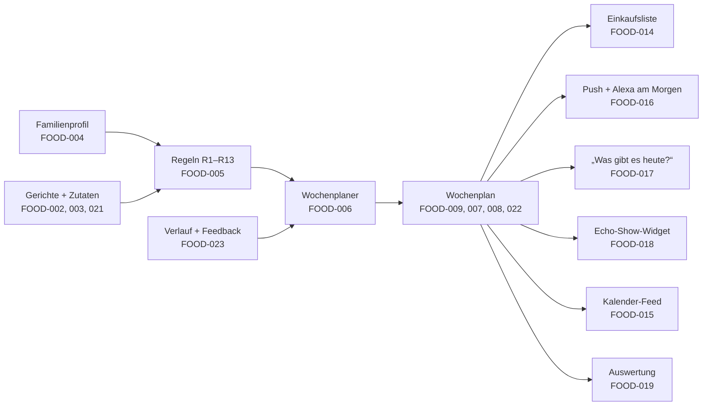

# Tenner 2.0 — Family Meal Planning (in planning)

> **„Was gibt's heute?“ — Tenner weiß es schon.**

Release 2.0 adds meal planning to Tenner: a weekly lunch and dinner plan that follows the family's rules, a shopping
list, and today's meals on the phone, in the calendar, by voice and on the Echo Show. The first version is
deterministic (no AI).

| | |
|---|---|
| **Status** | In progress. Foundation done (FOOD-001, 021, 002, 004, 003; FOOD-021 before 002 because dishes reference ingredients). Planning done (FOOD-005, 006, 009, 007, 022, 008): first usable version. Kitchen: FOOD-014, FOOD-010 (dish editor) and FOOD-011 (photos) done; next FOOD-012 |
| **Epic** | [EPIC-FOOD-001](metaticket.md): vision, household rules R1 – R13, dish catalog, owner decisions (answered) |
| **Backlog** | [`backlog/food/`](backlog/food/): FOOD-001 – FOOD-028 |
| **Previous release** | [Tenner 1.0](../release-1.0/README.md) |

---

## How It Fits Together



---

## Backlog

### Food (`backlog/food/`, prefix `FOOD-`)

| ID | Title | Priority | Phase |
|---|---|---|---|
| [FOOD-001](backlog/food/ticket001.md) | Meal Planning Architecture | Critical | 2.0 Core |
| [FOOD-002](backlog/food/ticket002.md) | Dish Data Model and Dish API | Critical | 2.0 Core |
| [FOOD-003](backlog/food/ticket003.md) | Seed the Family Dish Catalog | High | 2.0 Core |
| [FOOD-004](backlog/food/ticket004.md) | Family Food Profile | Critical | 2.0 Core |
| [FOOD-005](backlog/food/ticket005.md) | Meal Planning Rules Engine | Critical | 2.0 Core |
| [FOOD-006](backlog/food/ticket006.md) | Automatic Weekly Planner | Critical | 2.0 Core |
| [FOOD-007](backlog/food/ticket007.md) | Replace a Single Meal | High | 2.0 Core |
| [FOOD-008](backlog/food/ticket008.md) | Regenerate the Week | High | 2.0 Core |
| [FOOD-009](backlog/food/ticket009.md) | Meal Plan Page | Critical | 2.0 Core |
| [FOOD-010](backlog/food/ticket010.md) | Dish Editor | High | 2.0 Extended |
| [FOOD-011](backlog/food/ticket011.md) | Dish Photos | Medium | 2.0 Extended |
| [FOOD-012](backlog/food/ticket012.md) | Nutrition Estimate | Medium | 2.0 Extended |
| [FOOD-013](backlog/food/ticket013.md) | Cost Estimate | Medium | 2.0 Extended |
| [FOOD-014](backlog/food/ticket014.md) | Shopping List | High | 2.0 Core |
| [FOOD-015](backlog/food/ticket015.md) | Meal Calendar Feed (ICS) | Low | 2.0 Extended |
| [FOOD-016](backlog/food/ticket016.md) | Meal Notifications | High | 2.0 Extended |
| [FOOD-017](backlog/food/ticket017.md) | Alexa: „Was gibt es heute?“ | High | 2.0 Extended |
| [FOOD-018](backlog/food/ticket018.md) | Echo Show Meal Widget | High | 2.0 Extended |
| [FOOD-019](backlog/food/ticket019.md) | Food Analytics | Low | 2.0 Extended |
| [FOOD-020](backlog/food/ticket020.md) | Evaluate an AI Planning Engine | Low | Long-Term |
| [FOOD-021](backlog/food/ticket021.md) | Ingredient Reference Catalog | Critical | 2.0 Core |
| [FOOD-022](backlog/food/ticket022.md) | Choose, Swap and Lock Meals by Hand | High | 2.0 Core |
| [FOOD-023](backlog/food/ticket023.md) | Meal History and Feedback | Medium | 2.0 Extended |
| [FOOD-024](backlog/food/ticket024.md) | Evaluate Stock and AI-Generated Dish Images | Low | Long-Term |
| [FOOD-025](backlog/food/ticket025.md) | Release Tenner 2.0 | High | 2.0 Release |
| [FOOD-026](backlog/food/ticket026.md) | Shopping List via Alexa | Medium | 2.0 Extended |
| [FOOD-027](backlog/food/ticket027.md) | Shopping List as Its Own Navigation Entry | High | 2.0 Core |
| [FOOD-028](backlog/food/ticket028.md) | Shopping List Shows Counts Instead of Weights | High | 2.0 Core |

**Phases:** *2.0 Core* = the plan works every day (incl. shopping list) · *2.0 Extended* = everywhere and more
comfortable · *Long-Term* = evaluations, not part of 2.0 · *2.0 Release* = version and release notes.

### Recommended Order

```text
Foundation:        FOOD-001 → 002 → 021 → 004 → 003
Planning:          FOOD-005 → 006 → 009 → 007 → 022 → 008      ← first usable version
Kitchen:           FOOD-014 → 010 → 012 → 013 → 011
Everywhere:        FOOD-016 → 017 → 026 → 018 → 015
Insight:           FOOD-023 → 019
Release:           FOOD-025
Later (evaluate):  FOOD-020, FOOD-024
```

### Conventions

Same as release 1.0 (`../release-1.0/backlog/README.md`): `ticketNNN.md` per domain folder, ID `FOOD-NNN` in the
first heading, sections Type … Out of Scope, an "Implementation Status" section when done.

---

## Owner Decisions

All six questions were answered on 2026-10-07 and applied to the tickets: 20 minutes = active cooking time; coconut
milk is tolerated; R7 counts animal protein sources (poultry, fish; beef/pork by form: minced meat, burger, sausages, meatballs); Spätzle count as pasta, gnocchi and
Schupfnudeln are separate; weekday lunches only for the two adults; family details stay in the Git history and are
unrecognizable in current files. Details: [EPIC-FOOD-001](metaticket.md#owner-decisions).
