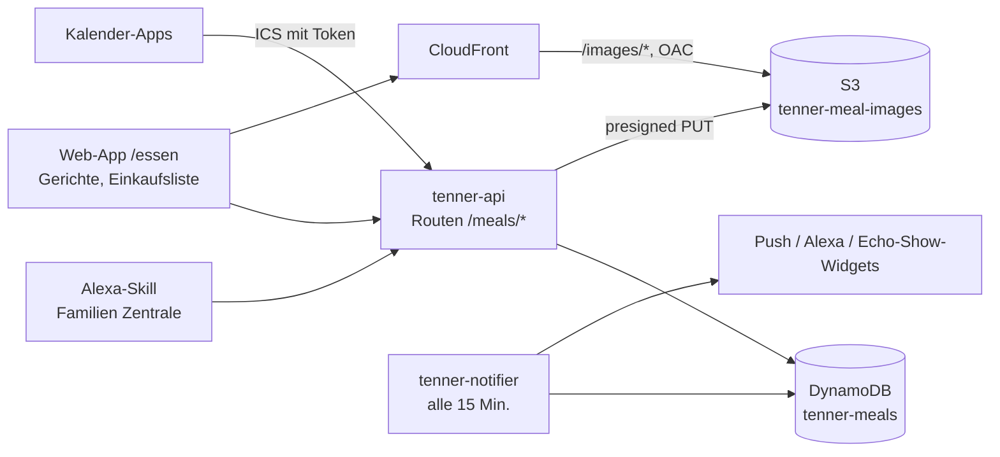

# Zentrale 2.0 — Familien-Essensplanung

> **„Was gibt's heute?“ — die Zentrale weiß es schon.**

Release 2.0 bringt die Essensplanung in die Zentrale (vorher „Tenner“): ein Wochenplan für Mittag- und Abendessen,
der die Regeln der Familie einhält, eine Einkaufsliste, und das heutige Essen auf dem Handy, im Kalender, per Stimme
und auf dem Echo Show. Ohne KI, nachvollziehbar und offline-fähig.

| | |
|---|---|
| **Version** | 2.0.0 (2026-10-10) — Changelog: [`CHANGELOG.md`](../../CHANGELOG.md#200---2026-10-10) |
| **Status** | Fertig: 26 von 28 FOOD-Tickets. Offen: die Bewertung FOOD-020 (KI) als Folgearbeit, das Release-Ticket FOOD-025 bis zum Tag `v2.0.0` |
| **Epic** | [EPIC-FOOD-001](metaticket.md): Vision, Haushaltsregeln R1 – R13, Gerichtekatalog, Owner-Entscheidungen |
| **Architektur** | [ADR 0007](../decisions/0007-meal-planning.md) (eine Tabelle, kein neuer Dienst) · [`docs/architecture.md`](../architecture.md) |
| **Vorher** | [Tenner 1.0](../release-1.0/README.md) |

---

## ✨ Highlights

- **Der Plan macht sich selbst:** jede Woche Mittag und Abend für diese und nächste Woche, mit Allergien, vegetarisch,
  Kochzeit, Hühnchen-Tagen, leichtem Mittagessen unter der Woche und Abwechslung. Ein Tipp tauscht, wählt, legt fest
  oder plant neu.
- **Lernt mit:** „Gekocht“, „Ausgefallen“, 👍 / 👎 und ⭐ — Lieblingsgerichte kommen öfter, gerade Gegessenes seltener.
- **Einkaufen ohne Rechnen:** eine Liste mit Stückzahlen statt Gramm, eigene Reihenfolge, offline im Laden, per Stimme
  („Alexa, sag Familien Zentrale, setz Milch auf die Einkaufsliste“) und als Echo-Show-Widget.
- **Überall:** „Essensplan am Morgen“ als Push oder Alexa-Erinnerung, „Alexa, frag Familien Zentrale, was es heute gibt“,
  Essen im Tagesbriefing, Echo-Show-Widget „Zentrale Essen“, Kalender-Abo für Google und Apple.
- **Gerichte selbst pflegen:** Editor mit Zutaten, Foto vom Handy, Nährwert- und Kostenschätzung und Hinweisen, für
  wen ein Gericht nicht passt.
- **Auswertung „Essen“:** Proteinquellen, vegetarischer Anteil, Lieblingsgerichte, Kosten pro Woche, Abwechslung.

---

## 🗓 Ein Tag mit der Zentrale

| Uhrzeit | Was passiert |
|---|---|
| 07:30 | Push oder Alexa: „🍽️ Heute: Mittag Onigiri · Abend Linseneintopf — Einkaufsliste: 3 Dinge offen“ |
| 08:00 | Dashboard: „Heute essen wir“, heutige Aufgaben, „Für morgen einkaufen“ |
| 12:00 | Kalender zeigt „🍽️ Mittag: Onigiri“ |
| 17:30 | Küche: „Alexa, frag Familien Zentrale, was es heute abend gibt“ |
| 19:00 | Nach dem Essen: „Gekocht“ und 👍 auf der Karte |
| Samstag | „Woche neu planen“ für nächste Woche, Einkaufsliste im Laden abhaken |

---

## 🏛 Architektur auf einen Blick



- **Eine Tabelle** `tenner-meals` (Gerichte, Zutaten, Profil, Pläne, Einkaufslisten, Kalender-Token) und **ein Bucket**
  für Fotos; die Routen laufen in der vorhandenen API-Lambda. Kein neuer AWS-Dienst (ADR 0007).
- Der **Planer** ist deterministisch (gespeicherter Seed) und nutzt Regeln R1 – R13, Verlauf und Bewertungen.
- Details: [`docs/architecture.md`](../architecture.md) → „Meal Planning“, Sicherheit: [`docs/security.md`](../security.md),
  Kennzahlen: [`docs/analytics.md`](../analytics.md).

---

## 📊 Release in Zahlen

| | |
|---|---|
| FOOD-Tickets | 25 von 28 fertig (dazu 6 Wartungs-, 2 Empfehlungs- und 2 Hotfix-Tickets seit 1.0) |
| API-Routen für Essen | 33 (davon eine öffentlich: der Kalender-Feed) |
| Katalog | 105 Zutaten, 61 Gerichte der Familie |
| Automatische Tests | 1.933 (Backend 1.145, Frontend 498, Alexa 160, Terraform 82, Skripte 48) |
| Kosten | + < 0,10 $ pro Monat (eine Tabelle, ein kleiner Bucket, keine KI) |

---

## 🔐 Sicherheit und Datenschutz

- Allergien und Abneigungen bleiben im Familienprofil: nie in Logs, Benachrichtigungen, Kalender oder Alexa-Antworten.
- Fotos liegen privat in S3 und werden nur über CloudFront ausgeliefert; Uploads sind auf Typ, Größe und Schlüssel des
  eigenen Haushalts beschränkt. Bitte nur Essen fotografieren.
- Der Kalender-Link ist geheim (256 Bit, nur als Hash gespeichert) und jederzeit widerrufbar; wer ihn hat, sieht die
  Gerichtsnamen. Restrisiken: [`docs/security.md`](../security.md#residual-risks).

---

## ⚠ Bekannte Einschränkungen

- Nährwerte und Kosten sind grobe Schätzungen aus den Katalogwerten; Preise pflegt ihr unter Einstellungen → Essen →
  „Preise“.
- Kalender-Apps holen Änderungen selbst ab (Google bis zu 24 Stunden).
- Der Plan reicht bis nächste Woche; Alexa kennt heute und morgen.
- Technische Schulden aus 2.0: TD-044 (Regelhinweise doppelt in App und Server), TD-045 (nicht zugeordnete Foto-Uploads),
  TD-046 (Zahlenfelder im Regel-Dialog), TD-047 (Kalender-Token im Zugriffslog). Liste:
  [`docs/technical-debt.md`](../technical-debt.md).

---

## 🚚 Getting Started

Nach dem Deploy, einmalig:

1. **Gerichtekatalog importieren:** Einstellungen → „Essen: Gerichtekatalog“ → prüfen → importieren.
2. **Familienprofil:** Einstellungen → Familienprofil: wer mitisst, Allergien, vegetarisch, Abneigungen; Planungsregeln
   (Kochzeit, Essenszeiten, Kostenstufen).
3. **Plan ansehen:** „Essen“ — der Plan für diese und nächste Woche entsteht beim ersten Öffnen.
4. **Benachrichtigung:** Einstellungen → Benachrichtigungen → „Essensplan am Morgen“, Kanal Push oder Alexa.
5. **Kalender:** Einstellungen → „Essen: Kalender“ → „Kalender abonnieren“, Link in Google oder Apple einfügen.
6. **Echo Show:** Widgets „Zentrale Essen“ und „Zentrale Einkaufsliste“ auf dem Startbildschirm hinzufügen
   ([`alexa/README.md`](../../alexa/README.md)).

**Owner-Schritt vor dem ersten Deploy mit Fotos:** Die Deploy-Rolle braucht Rechte auf den Bucket
`tenner-meal-images-<env>` (README → „CI Permissions“). **Nach dem Merge:** Tag `v2.0.0` und GitHub-Release (FOOD-025).

---

## 🔭 Folgearbeit

| Was | Ticket | Nächster Schritt |
|---|---|---|
| KI für Variationen, Saison, Reste | FOOD-020 | Daten 8 Wochen sammeln, Prüfung am 2026-12-07 ([ADR 0009](../decisions/0009-meal-ai.md)) |

---

## Backlog

### Food (`backlog/food/`, prefix `FOOD-`)

| ID | Title | Priority | Phase |
|---|---|---|---|
| [FOOD-001](backlog/food/ticket001.md) | Meal Planning Architecture | Critical | 2.0 Core |
| [FOOD-002](backlog/food/ticket002.md) | Dish Data Model and Dish API | Critical | 2.0 Core |
| [FOOD-003](backlog/food/ticket003.md) | Seed the Family Dish Catalog | High | 2.0 Core |
| [FOOD-004](backlog/food/ticket004.md) | Family Food Profile | Critical | 2.0 Core |
| [FOOD-005](backlog/food/ticket005.md) | Meal Planning Rules Engine | Critical | 2.0 Core |
| [FOOD-006](backlog/food/ticket006.md) | Automatic Weekly Planner | Critical | 2.0 Core |
| [FOOD-007](backlog/food/ticket007.md) | Replace a Single Meal | High | 2.0 Core |
| [FOOD-008](backlog/food/ticket008.md) | Regenerate the Week | High | 2.0 Core |
| [FOOD-009](backlog/food/ticket009.md) | Meal Plan Page | Critical | 2.0 Core |
| [FOOD-010](backlog/food/ticket010.md) | Dish Editor | High | 2.0 Extended |
| [FOOD-011](backlog/food/ticket011.md) | Dish Photos | Medium | 2.0 Extended |
| [FOOD-012](backlog/food/ticket012.md) | Nutrition Estimate | Medium | 2.0 Extended |
| [FOOD-013](backlog/food/ticket013.md) | Cost Estimate | Medium | 2.0 Extended |
| [FOOD-014](backlog/food/ticket014.md) | Shopping List | High | 2.0 Core |
| [FOOD-015](backlog/food/ticket015.md) | Meal Calendar Feed (ICS) | Low | 2.0 Extended |
| [FOOD-016](backlog/food/ticket016.md) | Meal Notifications | High | 2.0 Extended |
| [FOOD-017](backlog/food/ticket017.md) | Alexa: „Was gibt es heute?“ | High | 2.0 Extended |
| [FOOD-018](backlog/food/ticket018.md) | Echo Show Meal Widget | High | 2.0 Extended |
| [FOOD-019](backlog/food/ticket019.md) | Food Analytics | Low | 2.0 Extended |
| [FOOD-020](backlog/food/ticket020.md) | Evaluate an AI Planning Engine | Low | Long-Term |
| [FOOD-021](backlog/food/ticket021.md) | Ingredient Reference Catalog | Critical | 2.0 Core |
| [FOOD-022](backlog/food/ticket022.md) | Choose, Swap and Lock Meals by Hand | High | 2.0 Core |
| [FOOD-023](backlog/food/ticket023.md) | Meal History and Feedback | Medium | 2.0 Extended |
| [FOOD-024](backlog/food/ticket024.md) | Evaluate Stock and AI-Generated Dish Images | Low | Long-Term |
| [FOOD-025](backlog/food/ticket025.md) | Release Tenner 2.0 | High | 2.0 Release |
| [FOOD-026](backlog/food/ticket026.md) | Shopping List via Alexa | Medium | 2.0 Extended |
| [FOOD-027](backlog/food/ticket027.md) | Shopping List as Its Own Navigation Entry | High | 2.0 Core |
| [FOOD-028](backlog/food/ticket028.md) | Shopping List Shows Counts Instead of Weights | High | 2.0 Core |

**Phases:** *2.0 Core* = the plan works every day (incl. shopping list) · *2.0 Extended* = everywhere and more
comfortable · *Long-Term* = evaluations, not part of 2.0 · *2.0 Release* = version and release notes.

Status: 26 of 28 done (FOOD-024 decided: placeholders stay, ADR 0008). Open: FOOD-020 (evaluation, ADR 0009 proposed),
FOOD-025 (this release; tag after the merge).

### Recommended Order (as built)

```text
Foundation:        FOOD-001 → 002 → 021 → 004 → 003
Planning:          FOOD-005 → 006 → 009 → 007 → 022 → 008      ← first usable version
Kitchen:           FOOD-014 → 010 → 012 → 013 → 011
Everywhere:        FOOD-016 → 017 → 026 → 018 → 015
Insight:           FOOD-023 → 019
Release:           FOOD-025
Later (evaluate):  FOOD-020, FOOD-024
```

### Conventions

Same as release 1.0 (`../release-1.0/backlog/README.md`): `ticketNNN.md` per domain folder, ID `FOOD-NNN` in the
first heading, sections Type … Out of Scope, an "Implementation Status" section when done.

---

## Owner Decisions

All six questions were answered on 2026-10-07 and applied to the tickets: 20 minutes = active cooking time; coconut
milk is tolerated; R7 counts animal protein sources (poultry, fish; beef/pork by form: minced meat, burger, sausages, meatballs); Spätzle count as pasta, gnocchi and
Schupfnudeln are separate; weekday lunches only for the two adults; family details stay in the Git history and are
unrecognizable in current files. Details: [EPIC-FOOD-001](metaticket.md#owner-decisions).
